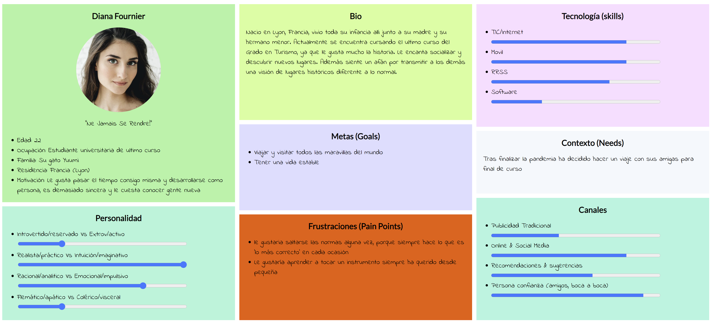
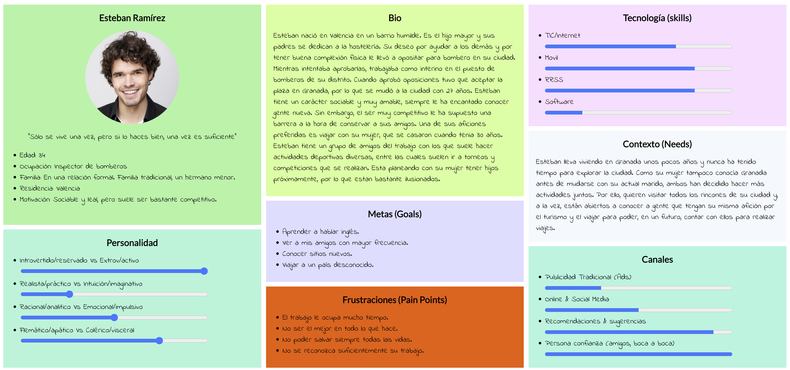
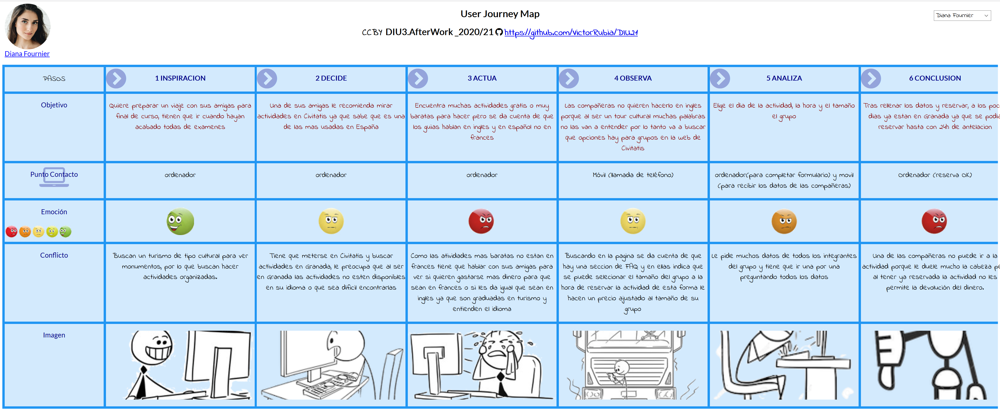

# DIU - Practica1, entregables

## **Desk research: Análisis Competencia**
El servicio que hemos elegido es **Civitatis**.

Algunos de sus competidores que hemos encontrado son **GetYourGuide** y **Walk in Granada**.
  - En cuanto a **Civitatis** es una web de estilo minimalista y se observa cómo funciones básicas, como un buscador, no las posee. En todas las actividades dispone de un mapa donde muestra claramente el punto de encuentro. Tienen muchos feedbacks en las actividades. Su mayor desventaja es que no se puede seleccionar el idioma de la actividad.
  - Al meternos en la web de **GetYourGuide** se ve bastante sencilla y fácil pero nos condiciona mucho que tenemos que poner la fecha para encontrar un tour, se muestran muchas actividades y bastante bien descritas, una ventaja es que además de buscar actividades en Granada capital, también tiene organizadas las actividades por sus distintos barrios.
  - Viendo **Walk in Granada**, nos damos cuenta de que es difícil encontrar las actividades en la página, hay poca variedad de actividades, no dispone de un buscador  ni tampoco se pueden seleccionar actividades por zonas.

## **2 Personas**

## **2 User Journey Map**  ( 1 por persona)

## **Revisión de Usabilidad** 

